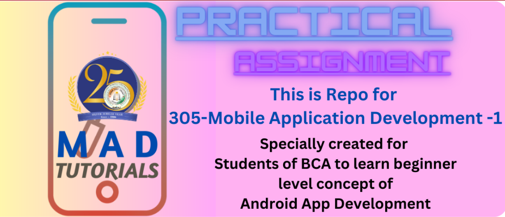

# Practical_Assignment
 Android Practical_Assignment 305 MAD-1
Welcome to the Android Practical_Assignment 305 MAD-1 Tutorial Demo repository! This project serves as a starting point for Android app development and provides hands-on examples and tutorials for beginners.



## Table of Contents

- [Getting Started](#getting-started)
- [Features](#features)
- [Tutorials](#tutorials)
- [Contributing](#contributing)
- [License](#license)

## Getting Started

To get started with this demo, follow these steps:

1. Clone this repository to your local machine:

   ```bash
   git clone https://github.com/sbccas/Practical_Assignment.git
